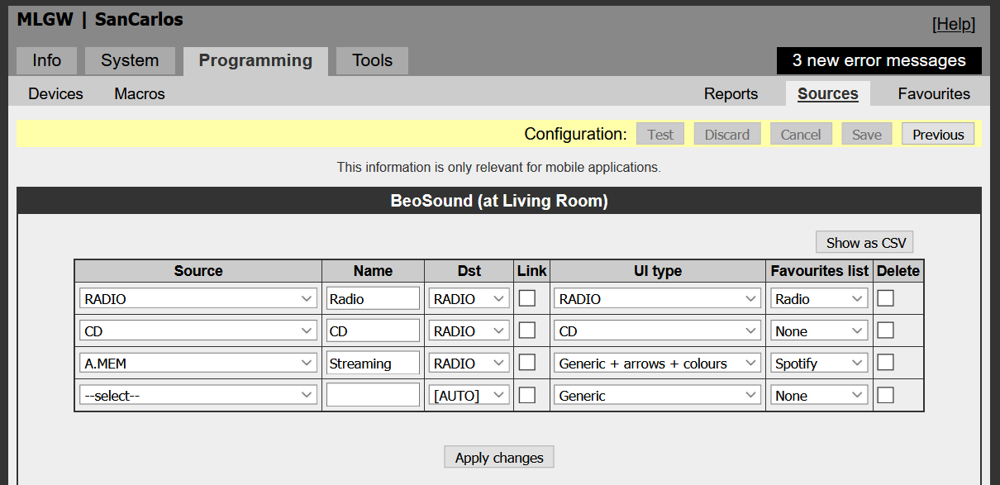
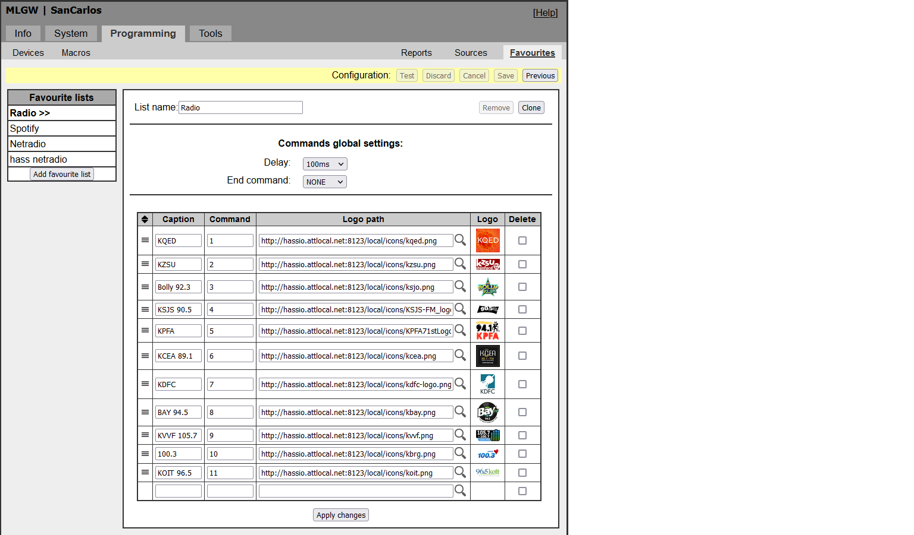
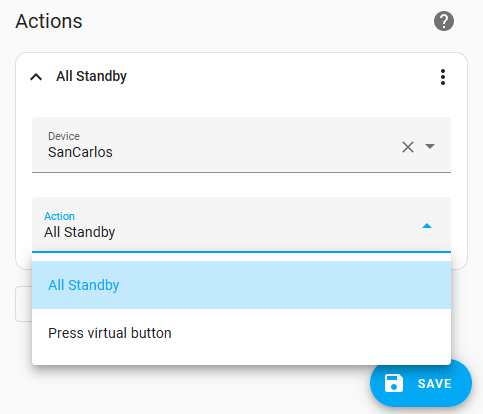

# Bang & Olufsen MasterLink Gateway / BeoLink Gateway - Home Assistant component

This component integrates Bang & Olufsen [Masterlink Gateway](http://mlgw.bang-olufsen.dk/source/documents/mlgw_2.24b/ML%20Gateway_Installation%20Guide%202v2.pdf) (2009) and [BeoLink Gateway](https://corporate.bang-olufsen.com/en/partners/for-professionals/smart-home) (2014) with Home Assistant. These devices support Masterlink, the [first generation B&O API](https://www.bang-olufsen.com/en/gb/story/beolink-history) to control their equipment, used from 1995 through 2015, and include BeoLab speakers, BeoSound audio equipment, and BeoVision TVs.

It will turn all your Bang & Olufsen audio and video devices into "media_player" entities in Home Assistant. By using an undocumented back door of the B&O gateways, you can use features unavailable even in the official B&O apps, including controlling streaming devices from your B&O remotes and integrating the equipment in automations. You can buy a used ML Gateway on ebay for $200-400. While newer 'Network Link' devices are supported by the gateway, the [BeoPlay Home Assistant plugin](https://github.com/giachello/beoplay) supports more advanced NL features. You can use both plugins at the same time. In that case, use MLGW for automations, and BeoPlay to control the device. [This is an example of a B&O / Home Assistant integrated setup](./setup_example.png)


## Installation

* With HACS: go to your HACS download panel, search for "MasterLink Gateway" and download from there. You need to restart.
* Manually: Create a `mlgw` directory in `/config/custom_components/` and copy all the files in the `/custom_components/mlgw` repository into it.

## Configuration 

MLGW should show up through auto discovery in your Configuration->Integrations panel on Home Assistant. If you don't see it, go to "Configuration->Integrations-> (+)" and look for MLGW. 

The configuration flow will ask for the IP address of the MLGW, username and password and whether to use the "Direct MasterLink" backdoor (see below). This backdoor significantly increases the power of the plugin. For example, it allows you to can start and control your Spotify or other streaming integrations directly from your Beo4 or BeoOne remote control.

The integration works also without this feature, but it's much better with it. To enable it, you must use the admin account to login. Explicitly select or unselect the feature before continuing.

### Setting up devices

The plugin will automatically pick up the configuration from the the MLGW. The devices and their sources must be configured in the MLGW/BLGW setup page (Programming->Devices->Beolink and Programming->Sources) as seen in the pictures below. 





Set up Favorites in the MLGW configuration settings, to configure radio stations. Similar to the offical BeoLink app, the icons and the names of these radio stations will show up in Home Assistant.  


You will need to reference icon urls on the Internet, or if you prefer more privacy, store the icons somewhere on your local network, for example on Home Assistant's www/icons folder, similar to the example in the picture below. Replace the URL with your specific situation.



There is also [a way to configure](./manual_config.md) through configuration.yaml for testing and hacking, but it is deprecated.


## Using the integration

### Speakers and Bang & Olufsen Sources

Beolink speakers (e.g., a [Beolab 3500](https://www.beoworld.org/prod_details.asp?pid=373) in your kitchen) will show up as normal "media_player" devices that you can control from Home Assistant, similar to what you'd get from the standard BeoLink app. I use [mini media player](https://github.com/kalkih/mini-media-player) because I like that it groups all items together. You can control volume and turn on the B&O sources from your Home Assistant dashboard.


Remember that only one source is shared on all the Masterlink speakers (it's a single zone system) so you can't play different sources on different speakers at the same time.

The implemented `media_player` commands include:

`turn_on, turn_off, select_source, volume_up, volume_down, volume_mute, media_previous_track, media_next_track, media_play, media_stop, media_pause, shuffle_set, repeat_set`

## Home Assistant Events

The more powerful use of this integration is to listen to events on the B&O system to power your automations.

### Lights and Virtual Buttons

The `mlgw` component forwards  Virtual Buttons, Light / Control commands from the remove control, "All Standby" and other commands to Home Assistant. Automations on HA can use them to power automations. You can see what events fire with the Home Assistant "Events" UI. (Developer tools->Events->Listen to Events and type: `mlgw.MLGW_telegram` in the field on the bottom of the page).

Light / Control and "All Standby" commands are also available as predefined [Triggers](https://www.home-assistant.io/docs/automation/trigger/). 

For example, if the user selects `LIGHT 1` on their Beo4 or BeoRemoteOne remote control, an Event in Home assistant will allow you to control your lights or a scene. Note that Light and Control events are only supported by the [devices listed here](http://mlgw.bang-olufsen.dk/source/documents/MLGW%20product%20compatibility.doc).

The following Event Automation catches "All Standby" (which means the entire B&O system is turned off). You can use it to turn off Spotify streaming:


There are 5 events fired by the official integration:

| Event              | Payload Type        | Arguments                                                                                                                                                                                                                                |
| ------------------ | ------------------- | ---------------------------------------------------------------------------------------------------------------------------------------------------------------------------------------------------------------------------------------- |
| mlgw.MLGW_telegram | all_standby         | _none_                                                                                                                                                                                                                                   |
| mlgw.MLGW_telegram | virtual_button      | button: button number, action: (PRESS,RELEASE,HOLD)                                                                                                                                                                                      |
| mlgw.MLGW_telegram | light_control_event | room: room number, type: (CONTROL or LIGHT), command: the BEO4 key pressed after "LIGHT"                                                                                                                                                 |
| mlgw.MLGW_telegram | source_status       | source_mln: device causing the event, source: the active Source (RADIO, CD, etc.), source_medium_position, source_position, source_activity: (Playing, Standby, etc.), picture_format are all information related to the specific source |
| mlgw.MLGW_telegram | pict_sound_status   | source_mln: device causing the event, sound_status, speaker_mode, volume, screen1_mute, screen1_active, screen2_mute, screen2_active, cinema_mode, stereo_mode                                                                           |

### Trigger Device Automations

You can use a subset of LIGHT + \<key\> commands to generate automation triggers in a simple way for the MLGW gateway. Just create a new automation from the device screen for your MLGW. You will find the Triggers listed under the MLGW device name. In the example below, the device name is "SanCarlos". This is the same name configured in the MLGW configuration panel.


### "Direct MasterLink"

A special undocumented feature of the Master Link Gateway allows captures _ALL_ traffic on the Masterlink bus, including events that aren't included in B&O's standard API, like a speaker turning off, or specific key presses on the remote control.

You can use them to drive much more interesting behavior. For example, you can:

- start Spotify by pressing the "green" button on your Beo4 remote after selecting `A.MEM` (the source associated with the Aux input on B&O equipment where you can connect a streaming devices like a Chromecast Audio).
- use the "Blue" button to turn off a speaker and turn on another one when moving within the house
- use the number buttons to select different 'streaming radios' through the ['netradio'](https://github.com/giachello/netradio) plugin.
- use the up, down, wind, rewind buttons to switch Spotify playlists or move to the next song in the playlist.

The possibilities are endless. You can see a few examples here: [https://github.com/giachello/mlgw/blob/main/example_automations.yaml](example_automations.yaml). An easy way to see what goes on the ML bus is using the "Events" UI. (Developer tools->Events->Listen to Events and type: `mlgw.ML_telegram` in the field on the bottom of the page.

For example the following setup catches the Green key event on the Beo4 remote.


Another example is to stop playback when the "Stop" button is pressed on the remote (in this case, "media_player.bang_olfusen" is the Chromecast connected to the input of the B&O audio system):


There are a lot of ML telegram types; a few useful telegrams you can use in automations are listed in the table below. The most useful are likely going to be the BEO4_KEY (a key press on the B&O remote control). A full list of BEO4 Keys is available in this file: [const.py](https://github.com/giachello/mlgw/blob/main/custom_components/mlgw/const.py)


| Event            | Payload Type     | Arguments              | Payload Argument                                                   | Description                                                                                  |
| ---------------- | ---------------- | ---------------------- | ------------------------------------------------------------------ | -------------------------------------------------------------------------------------------- |
| mlgw.ML_telegram | GOTO_SOURCE      | from_device, to_device | source, channel_track                                              | Speaker (from_device) requests a source                                                      |
| mlgw.ML_telegram | RELEASE          | from_device, to_device |                                                                    | Speaker (from_device) turned off                                                             |
| mlgw.ML_telegram | STATUS_INFO      | from_device, to_device | source, channel_track, activity, source_medium, picture_identifier | Source status changes                                                                        |
| mlgw.ML_telegram | TRACK_INFO       | from_device, to_device | subtype (Change Source, Current Source) , prev_source, source      | The source changed                                                                           |
| mlgw.ML_telegram | STANDBY          | from_device, to_device |                                                                    | Turn off device (to_device)                                                                  |
| mlgw.ML_telegram | BEO4_KEY         | from_device, to_device | source, command                                                    | Beo4 remote key press for a speaker (from_device)                                            |
| mlgw.ML_telegram | TIMER            | from_device, to_device |                                                                    | Timer functionality invoked                                                                  |
| mlgw.ML_telegram | MLGW_REMOTE_BEO4 | from_device, to_device | command, dest_selector                                             | The B&O app or Home Assistant sends a BEO4 command through the MLGW to a speaker (to_device) |
| mlgw.ML_telegram | TRACK_INFO_LONG  | from_device, to_device | source, channel_track, activity                                    | Information about the track that is playing                                                  |

## Sending Virtual Button Commands

You can send virtual button commands to the MLGW/BLGW by using the `mlgw.virtual_button` service. This is useful if you want to activate macros on the MLGW. You can send PRESS, HOLD and RELEASE commands, but typically you will just need to send one PRESS. [This documentation file](http://mlgw.bang-olufsen.dk/source/documents/mlgw_2.24b/MlgwProto0240.pdf) describes how to use the HOLD and RELEASE commands.


Alternatively, you can use the "Action" setting in an automation to send Virtual Button and 'All Standby' commands, as shown below.



## Debugging

You can see the details of the plugin operation, including what is being fired by the MasterLink bus by enabling "DEBUG" logging in Configuration.yaml. Then just look at your home-assistant.log file.

```
logger:
  default: warning
  logs:
    custom_components.mlgw: debug
```

## Not implemented / TODO

- Timer and Clock packets unpacking

## Known Issues

- When a Audio Master or a Video Master starts playing a source that it owns (e.g., a BeoSound 3000 turning on A.MEM), it doesn't tell the ML bus that is happening, so we cannot detect it in the plugin. Unfortunately, there is no known solution.
- When a Video Master has several sources active at the same time (e.g., a Decoder on 'TV' being played locally and a tuner on 'DTV' being distributed on the system) it reports both sources at the same time and that confuses the plugin.

## High level description of the code

- **gateway.py** deals with the communication with the mlgw and is likely code that should go into a separate library / python module (PyPI). It has some code to fire events on home assistant when things happen on the MLGW.
- **config_flow.py** is the configuration flow and is Home Assistant specific. It stores the MLGW host and password configuration parameters inside HA which are then used by **\_\_init\_\_.py**. There is one piece of MLGW-specific code (to get the serial number through XMPP).
- **\_\_init\_\_.py** is called by Home Assistant to start the module. It calls gateway.py to create a gateway instance. It also pulls the json configuration from the gateway that lists all the devices configured on the gateway.
- **media_player.py** creates "MediaPlayer" entities in Home assistant for each MLGW device. The `BeoSpeaker` class manages the communication to and from the MLGW on an ongoing basis. There is one instance of the class for each device (speaker, audio, TV) in the MLGW configuration. It monitors the traffic on both the MLGW api and on the special masterlink backdoor.

Because the ml/mlgw is a single zone system and not all features are documented, there is a lot of random code to handle corner cases (e.g., if one speaker changes source, all other should too, because it's a single zone system, handling multiple video sources...).
